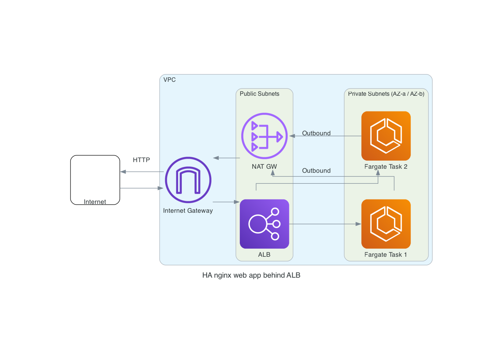

# AWS NGINX App HA deployment

This project uses Terraform to deploy a containerized web application (based on [`nginxdemos/hello`](https://hub.docker.com/r/nginxdemos/hello)) container image on AWS ECS Fargate, behind an  Application Load Balancer (ALB).

## Architecture Overview

- **ECS Fargate**: Hosts stateless Docker containers in private subnets.
- **Application Load Balancer (ALB)**: Distributes public HTTP traffic across ECS tasks.
- **Public and Private Subnets**: Distributed across 2 Availability Zones to achieve high availability.
- **NAT Gateways**: One per AZ for secure outbound internet access for ECS.
- **Internet Gateway**: Allows connectivity between ALB and NAT Gateway and the Internet.

<picture>
    
</picture>

## How to Consume

### Prerequisites

- Terraform
- Git

### Steps
Local:
1. Clone the repository (git clone)
2. Update backend s3 bucket information for terraform state file hosting (backend.tf)
3. Initialize and deploy with Terraform
    - terraform init
    - terraform apply
Make sure your AWS credentials are configured! (aws configure)

GitHub:
1. Clone the repository (git clone)
2. Update backend s3 bucket information for terraform state file hosting (backend.tf)
3. Update repository secrets to store AWS Access Key ID and Secret Access Key
4. Push the local branch to your GitHub repository

## Security Improvements

To further enhance application's security, the following steps can be taken:
- Use custom DNS domain to direct the traffic to the Application Load Balancer
- Generate SSL Certificate for the domain using AWS Certificate Manager (automated renewals) or generate your own certificate and upload it to AWS Certificate Manager
- Update ALB listener to use HTTPS on port 443 with the generated certificate
- Enable Web Application Firewall to enhance web app security and protect it against common Layer 7 attacks or IP whitelisting
- Enable CloudTrail and VPC Flow Logs for monitoring

## Variables

The code is provided with default variables values. You can further customize those values to modify IP CIDRs as well as setup Route53 configuration if required.